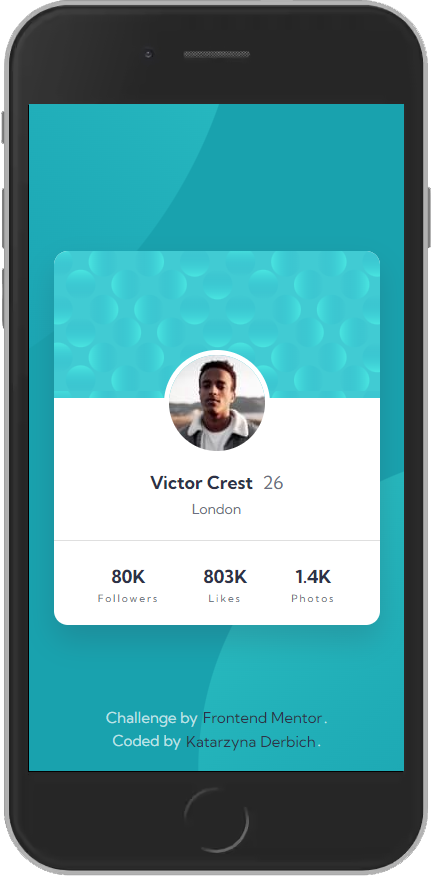
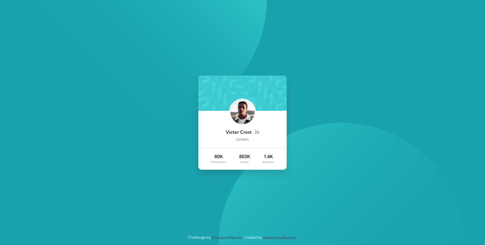

# Frontend Mentor - Profile card component

This is a solution to the [Profile card component challenge on Frontend Mentor](https://www.frontendmentor.io/challenges/profile-card-component-cfArpWshJ). Frontend Mentor challenges help you improve your coding skills by building realistic projects.

## Table of contents

- [Overview](#overview)
  - [The challenge](#the-challenge)
  - [Screenshots](#screenshots)
  - [Links](#links)
- [My process](#my-process)
  - [Built with](#built-with)
  - [What I learned](#what-i-learned)
- [Author](#author)

## Overview

### The challenge

- Building a website according to the requirements and design project.
- Get it looking as close to the design as possible (projects in `/design` folder: mobile and desktop version).

### Screenshots

- Mobile Solution (375px width):

  

- Desktop Solution (1920px width):

  

### Links

- Solution URL: [GitHub Solution](https://github.com/belie369/frontend-mentor-profile-card-component)
- Live Site URL: [GitHub Live](https://belie369.github.io/frontend-mentor-profile-card-component/)

## My process

### Built with

- Semantic HTML5 markup
- SASS SCSS
- CSS3 animations
- BEM methodology
- Flexbox
- Mobile-first workflow
- Gulp
- Prettier

### What I learned

- I repeated my knowledge of CSS animations
- I remembered my knowledge from BEM

## Author

- Website - [katarzynaderbich.pl](http://katarzynaderbich.pl/)
- Frontend Mentor - [@belie369](https://www.frontendmentor.io/profile/belie369)
- Twitter - [@belie369](https://www.twitter.com/belie369)
